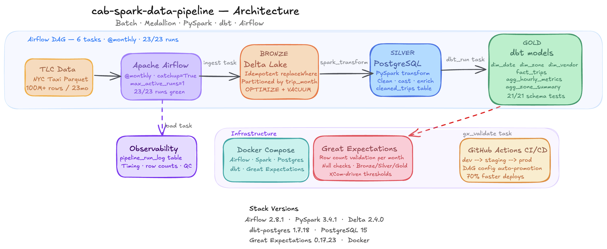

# NYC Taxi Pipeline

## Architecture



> **Stack:** Airflow 2.8.1 · PySpark 3.4.1 · Delta 2.4.0 · dbt-postgres 1.7.18 · PostgreSQL 15 · Great Expectations 0.17.23 · Docker


Production-grade batch data pipeline processing 100M+ NYC taxi trips across 23 months of TLC data (Jan 2024 - Nov 2025).

**Stack:** Apache Airflow · PySpark · Delta Lake · dbt · Great Expectations · PostgreSQL · Docker

## Architecture

```
NYC Taxi Parquet (TLC public data)
        |
        v
Airflow DAG (@monthly, catchup=True, max_active_runs=1)
  ingest           — stream-download TLC parquet -> Delta bronze (idempotent)
  spark_transform  — PySpark: cast, clean, enrich -> Postgres silver
  delta_optimize   — OPTIMIZE + VACUUM bronze Delta table
  dbt_run          — dbt seed + dbt run (6 models) + dbt test (21 tests)
  gx_validate      — Great Expectations: per-month row counts + null checks
  load             — write pipeline_run_log observability row
        |
        v
Delta Lake + PostgreSQL (medallion architecture)

  Bronze  — yellow_tripdata       (Delta Lake, partitioned by trip_month)
  Silver  — cleaned_trips         (Postgres, written by spark_transform)
  Gold    — dim_date              (Postgres, dbt table model)
            dim_zone              (Postgres, dbt table model)
            dim_vendor            (Postgres, dbt table model)
            fact_trips            (Postgres, dbt table model)
            agg_hourly_metrics    (Postgres, dbt table model)
            agg_zone_summary      (Postgres, dbt table model)
  Meta    — pipeline_run_log      (Postgres, observability)
  Seed    — taxi_zones            (Postgres, dbt seed — 265 NYC zones)
```

## Pipeline Status


*23/23 monthly runs green — Jan 2024 to Nov 2025 backfill complete*

## Quick Start

```bash
# Start the stack
docker compose up -d

# The DAG auto-backfills Jan 2024 -> Nov 2025 (23 runs, sequential)
# No manual triggers needed — open http://localhost:8081 to monitor
# Login: airflow / airflow
```

## Stack Versions

| Component | Version |
|-----------|----------|
| Apache Airflow | 2.8.1 |
| PySpark | 3.4.1 |
| delta-spark | 2.4.0 |
| dbt-postgres | 1.7.18 |
| Great Expectations | 0.17.23 |
| PostgreSQL | 15 |

## Data Flow

1. **ingest** — Downloads one month of TLC yellow taxi parquet (~50 MB), casts TimestampNTZ columns to Timestamp, writes to Delta bronze with replaceWhere for idempotency
2. **spark_transform** — Reads bronze Delta, applies cleaning filters (date, fare, distance, duration, payment type), computes derived columns (trip_duration_min, speed_mph, is_airport_trip, tip_percentage with outlier caps), writes to Postgres cleaned_trips
3. **delta_optimize** — Runs OPTIMIZE (bin-pack small files) + VACUUM (7-day retention) on the bronze partition
4. **dbt_run** — Seeds taxi_zones lookup (265 NYC zones), runs 6 gold models (3 dims + fact + 2 aggs), runs 21 schema tests
5. **gx_validate** — Validates row counts per month against XCom values from upstream tasks, checks nulls and ranges across bronze/silver/gold layers
6. **load** — Writes one observability row to pipeline_run_log with timing, row counts, and quality results per run

## Project Structure

```
nyc-taxi-pipeline/
├── airflow/
│   ├── dags/
│   │   └── taxi_pipeline.py       # DAG definition
│   └── tasks/
│       ├── ingest.py              # Bronze layer
│       ├── spark_transform.py     # Silver layer
│       ├── delta_optimize.py      # Delta maintenance
│       ├── dbt_run.py             # Gold layer
│       ├── gx_validate.py         # Data quality
│       └── load.py                # Observability
├── dbt/
│   ├── models/gold/               # 6 dbt table models
│   └── seeds/                     # taxi_zones.csv
├── sql/
│   └── create_tables.sql          # Postgres schema
├── Dockerfile
└── docker-compose.yml
```

## Branches

| Branch | Status | What it adds |
|--------|--------|---------------|
| feature/core-pipeline | merged | Airflow + Postgres foundation |
| feature/spark-transform | merged | PySpark transform layer |
| feature/dbt-models | merged | SQL models + data tests |
| feature/great-expectations | merged | HTML data quality reports |
| feature/delta-lake | merged | Delta bronze, star schema gold, catchup backfill |
| fix/catchup-backfill-jan2024-nov2025 | current | End-to-end stability fixes across all tasks |
